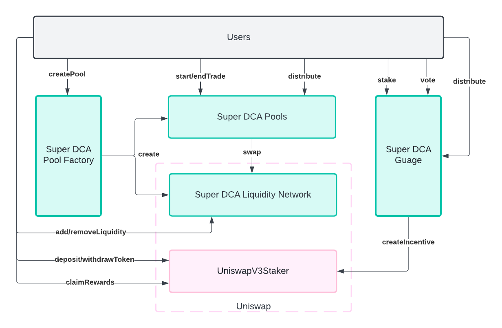
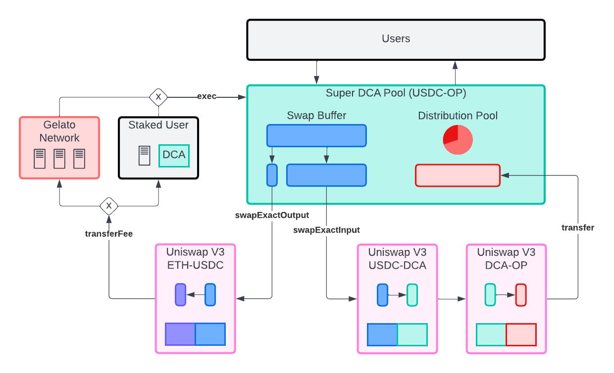
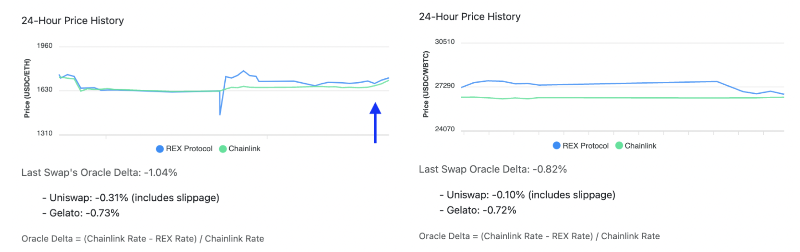
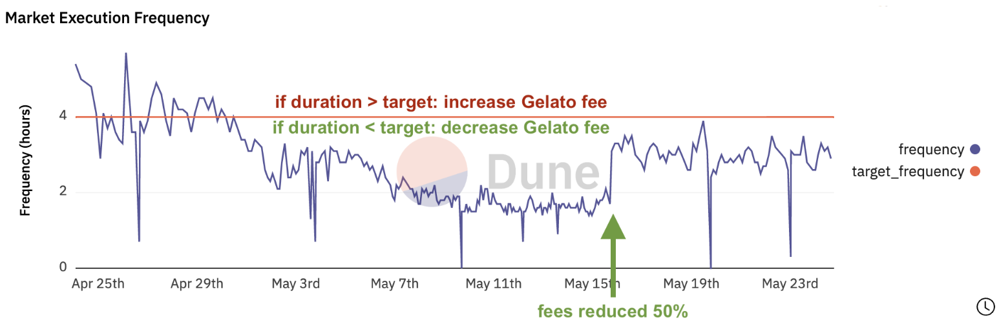
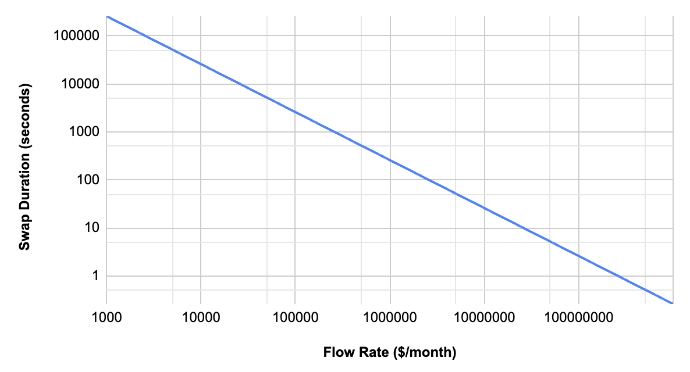
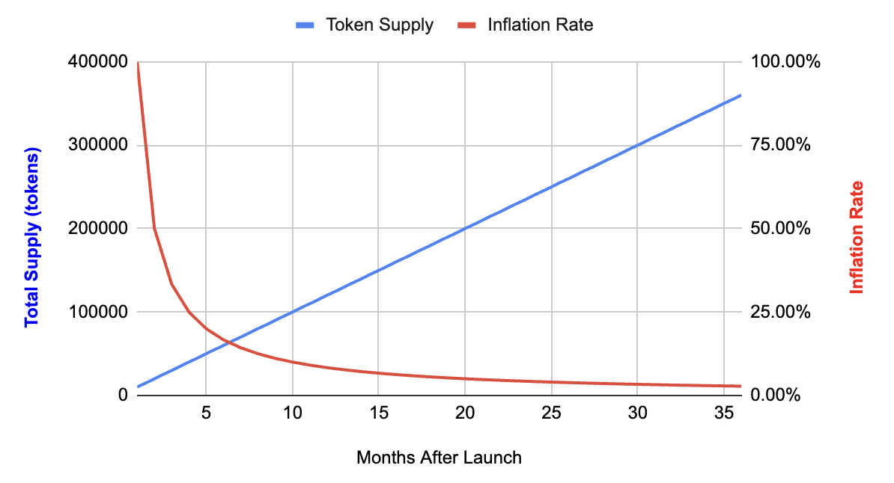
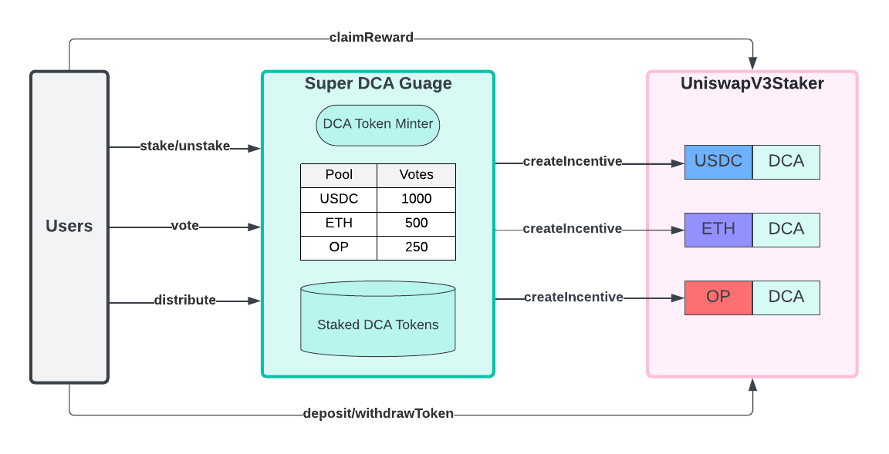
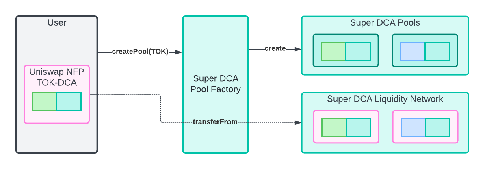
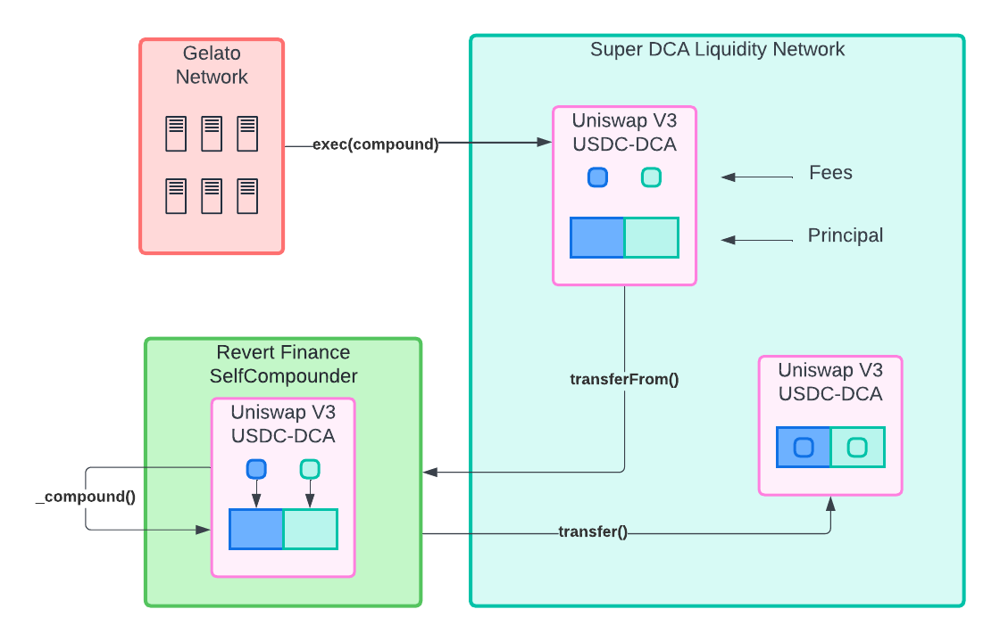

# Super DCA: Time Weighted Average Market Maker

# Introduction

Super DCA is based on the Time Weighted Average Market Maker (TWAMM) design proposed by Dave White, Dan Robinson, Hayden Adams in 2022 [Paradigm]. It introduces novel architectural features that make it unique among other TWAMMs in the following ways:

- **Fees Accrue to Stakeholders:** Automated market maker fees (i.e. Uniswap fee) and execution fees (i.e. keeper fee) are typically extracted from the protocol. They flow to participants that have no stake in the protocol. Super DCA uses a token to internalize the fees so that stakeholders earn the fees. This is done by routing swaps through the DCA token (e.g., USDC to DCA to ETH) on Uniswap and by allowing holders to stake their DCA tokens to a pool to earn the execution fee that would otherwise go to Gelato Network.
- **Simple Solver:** Super DCA requires no complex solvers in order to run. Execution involves simply checking if the gas paid is less than or equal to the expected reward earned. Therefore, competition to be a keeper for a pool is strictly a matter of who can stake the most DCA token to the pool to earn the right to trigger swaps and collect the fee. The simplicity of the process means there’s no edge to be had by technically sophisticated participants. Additionally, front running execution is not possible due to the staking mechanism.
- **Fees Lower with More Volume:** There is an inescapable network execution fee that must be paid to execute a swap. Therefore, Super DCA uses a percentage of the swap’s input amount to pay the gas. DCA pools that swap faster than a threshold duration (e.g., 4 hours) will dynamically lower the percentage of input amount used to pay this fee. Pools aim to target a specific frequency (e.g., every 4 hours) and when they are faster they start to reduce the fraction of the input amount used to pay for execution.

# Time Weighted Average Market Makers

The Time-Weighted Average Market Maker (TWAMM) is completely described in [Paradigm] and briefly summarizes in this section. Unlike traditional AMMs, TWAMM specializes in executing large orders efficiently by breaking them down into infinitely small virtual sub-orders. This addresses adverse selection and price impact concerns. TWAMM spreads order execution smoothly over time, ensuring transactions occur at prices closely aligned with prevailing market rates. This time-weighted approach is inspired by algorithmic trading strategies. This TWAMM approach minimizes transaction costs by amortizing gas fees across the multitude of virtual trades. TWAMM's design incorporates mechanisms to counter potential attack vectors such as sandwich attacks and information leakage. TWAMMs are a significant leap forward in DeFi infrastructure, bridging the gap between traditional finance concepts and decentralized market mechanisms, and offering a promising solution for efficient and secure trading on Ethereum and beyond.

# Architecture

TWAMMs work by "breaking long-term orders into infinitely many infinitely small pieces and executing them against an embedded constant-product AMM smoothly over time" [Paradigm]. This section details the basic design of Super DCA TWAMM. An overview of the architecture is shown in the diagram below along with a short description of each component that makes up the Super DCA system.

_Figure 1: Super DCA protocol architecture overview_

- **Users:** Super DCA users interact with Pools by starting and ending trades. Trades are initiated by opening a Superfluid Finance stream of tokens to the Pool contracts themselves. Users can also create pools at the Pool Factory and use their DCA tokens to stake and vote on the Gauge contract. Users add liquidity on Uniswap and deposit their nonfungible position (NFP) to the Uniswap Staking contract to earn liquidity incentives.
- **Pool Factory:** This contract allows users to create new Pools by depositing a full-range Uniswap NFP into the factory. This deposit triggers the creation of the Pool and creates locked liquidity so that the pool will exist forever having some liquidity.
- **Pools:** The contracts function as middleware between the User that opens a stream to the pool and the embedded AMM used to perform the swaps. Pools are created by the Pool Factory. Users can trigger swaps by calling the distribute method on the pool.
- **Gauge:** The Gauge works in a similar manner to Curve's gauge contracts [Curve]. Users stake DCA tokens and vote on how the emissions of DCA tokens are directed to pools in the Liquidity network. The gauge creates incentives for users to become liquidity providers using Uniswap’s Staking contract.

### Pool Mechanics

Super DCA uses Superfluid, Uniswap, and Gelato in combination to create a TWAMM. The details of these are shown in the Figure below. Users stream tokens into the Super DCA Pool. The tokens accumulate in an internal swap buffer. Once enough tokens have accumulated in this buffer such that a fraction (e.g., 1%) can be used to pay for the execution of the swap, either Gelato or a Staked User will trigger the swap. The remaining input token amount is then swapped using Uniswap. The swap itself routes through the Super DCA protocol token which means that DCA token stakers immediately realize the liquidity pool fees collected as part of the Uniswap protocols functionality. After the swap occurs, the output token (e.g., OP) lands back in the Super DCA Pool where it is distributed using Superfluid proportional to each users input amount.

_Figure 2: Users stream tokens into the Pool using Superfluid, Gelato or a staked user will trigger the swap once enough input tokens have accumulated such that a fraction will cover the gas cost plus a premium, input tokens are swapped through the protocol's token using two Uniswap pools, the output tokens are distributed back to users using Superfluid again._

### Protocol Token

Super DCA introduces its own token, the DCA token. The token is used in the following ways:

- **Liquidity Incentive:** The liquidity for the protocol’s embedded AMM is bootstrapped using token incentives similar to Curve. DCA tokens are minted at a fixed rate (i.e., 10000 per month) in perpetuity. Half of the inflation is directed to liquidity providers. The distribution uses a gauge system and Uniswap V3 Staking Contract [UniswapStaker] to incentivize liquidity providers.
- **Staking to Earn AMM Fees:** DCA token is used to provide liquidity to the protocol. DCA tokens are paired with other tokens like USDC and ETH in Uniswap V3 pools. The protocol then routes swaps through these pools using a path like [USDC, DCA, ETH]. In this way, USDC-DCA and ETH-DCA liquidity providers both earn the Uniswap AMM fee of 0.05% per pool (0.1% total).
- **Staking to Earn Execution Fees:** A portion of the swap is used to pay for execution of the swap. Gelato acts as a fallback executor, executing the swap when enough input tokens have accumulated to pay the Gelato fee. Gelato takes a premium on the gas used to execute, on Optimism the premium if 50%. DCA token holders can stake DCA on a Super DCA pool to earn the right but not the obligation to trigger the execution at any point before Gelato. In this way they can earn the premium that would otherwise go to Gelato. On Optimism this means they could earn up to 50% premium on the gas used, by effectively undercutting Gelato.
- **Gauge Voting for Token Distribution:** Distribution of the DCA token is handled similar to Curve and Balancer. A gauge contract is used to distribute DCA tokens to registered Uniswap pools. The Uniswap Staking contract is then used to create incentives for liquidity providers. Every two weeks the weights for the pools can be updated based on the amount of DCA tokens staked to each pool. During the two week period, staked tokens are locked. Tokens can be unlocked and unstaked in the last 24 hours of the two week period.

### Embedded AMM using a Uniswap Liquidity Network

Super DCA creates its own network of liquidity on Uniswap. It does this by pairing tokens with its own protocol token, the DCA token. Swaps between two tokens, like USDC to ETH, are routed through two Uniswap pools, USDC-DCA and DCA-ETH. The route through the protocol’s DCA token. The collection of DCA pools on Uniswap create a liquidity network for the protocol to use.

_Figure 3: Super DCA Liquidity Network, routes swaps through two pools, each pool is paired with the DCA token, pools take 0.05% fee so the net fee through the network is 0.1%_

The liquidity network is an open network that meets the description of the TWAMM describe by Paradigm. Mainly, it allows anyone to trade with the protocols liquidity network (i.e., embedded AMM) at any time, “just as if it were a normal AMM.” This is a necessary feature since it means that other traders will be incentivized to keep the various DCA pools inline with the global exchange rates. Arbitrage opportunities created as the price of tokens moves means that searchers will keep the liquidity pools' exchange rates inline with global exchange rates.

A common criticism of the Super DCA design is that these pools will have suboptimal prices since they will have less liquidity and will use their own token. In practice, this proved to not be a concern. A short pilot of the Super DCA design on a live network resulted in prices that were within an acceptable rate with only a small amount of concentrated liquidity on Uniswap V3. Below shows the results of this pilot.

Figure 4 is a price history of a pilot USDC to ETH pool. It routes tokens through two pools that both take 0.05% fee. Gelato takes a dynamic fee which starts at 1%, with each swap executed under 4 hours it reduces the fee. The Last Swap’s Oracle Delta of -1.04% can be attributed to Uniswaps pool fee plus slippage (-0.31%) and Gelato’s execution fee which at the time was -0.73%. To achieve this result, the liquidity provided was broken down as follows, these values are the amounts of ETH/USDC paired with protocol tokens:
- 700 USDC worth of ETH concentrated 
- 550 USDC worth of ETH full range 
- 325 USDC concentrated 
- 550 USDC full range

_Figure 4: Super DCA exchange rate comparison to Chainlink reported rate, Oracle Delta statistics are broken down to show the amount attributed to each source_

This design was able to achieve acceptable rates, comparable to Chainlink’s price, with a minimal amount of liquidity provided as full range and concentrated.

On the right is a price history of the pilot of USDC to WBTC. This pool introduced more concentrated liquidity and so was able to achieve a Uniswap price impact equal to the sum of the pool fees (i.e., there was no significant slippage).

### Long Term Orders with Superfluid

Super DCA accepts orders in the form of a rate of tokens per second. This is handled using the Superfluid Finance protocol, which uses wrap tokens as Supertokens to support streaming tokens to the Super DCA contract address at a specific rate. In this way users of Super DCA open long term orders to swap tokens. Superfluid allows streams to be left open indefinitely or specify an end date.

### Order Pools with Dynamic Fees

All orders are pooled and swapped in a single swap. This is common in other TWAMM designs. However, other DCA protocols do not offer lower fees as a function of how large the pool is. It would make sense that a percentage of the pool’s swap amount would be given to the entity that executes the transaction. This is justifiable since an inescapable transaction fee (gas) needs to be paid. However, while other TWAMM charge a fixed fee, Super DCA dynamically lowers its fee as more people join the pool.

Figure 5: Execution frequency relative to target frequency, Gelato fee reduced from 1% to 0.5% where indicated on the chart, execution frequency decreases (duration increases) after the reduction in fee._

### Small and Fast Swaps

Given enough inflow order volume, Super DCA will be able to execute one swap per block. That is, it would incentivize executing one swap per block. The actual execution frequency may vary with network conditions. This is because it executes swaps after enough input tokens are available to cover the transaction fee (see Figure below for a view of how the fee is used to execute the swap). The transaction fee is a dynamic value dependent solely on the network gas price. The frequency of swaps is influenced by (1) the flow of funds into the pool for DCA and (2) the gas price.

_Figure 6: As order flow increases, the duration between swaps decreases, this chart is generated assuming that 1.0% of the input amount is used to pay the gas fee and the gas fee per swap is $1, above $10M/month swaps would execute around every 10 seconds (i.e once per Ethereum block)._

With more inflow order volume, the amount to swap will accumulate faster and so it will have enough input amount to cover the transaction fee sooner. As a result, the more order flow the Super DCA Pool receives, the more frequently it will execute swaps. Figure 6 shows the relationship between order flow and swap duration for a Super DCA Pool. As order flow increases (x-axis) the duration between swaps decreases (y-axis). At high volumes (above 100M USDC/month) the duration eventually falls below the network block times. At this point, there would be enough incentive to execute the swaps in every block.

### Peripheral Features

The liquidity network creates a base liquidity layer to build upon and the core Super DCA Pool contract is extensible. This design closely follows Uniswap in that there are core contracts and there are periphery contracts. Super DCA follows the same pattern.

#### Limit Orders

The commonly requested feature is limit orders. Using Superfluid allows for peripheral systems to be created that support functionality like limit orders without modifying the core protocol.

#### Yield

Super DCA Pools can handle unwrapping yield bearing tokens before or after executing the swap. Additionally, Superfluid supports yield bearing streamable tokens like Alluo Finance's interest bearing (ib) tokens. In this way, users can have the benefit of earning yield on their assets while they are being used in Super DCA.

# Token Economics

_Figure 7: Super DCA token emissions over time_

Super DCA token (DCA) distribution is modeled after Tellor Tributes (TRB) [Tellor]. The first 10000 tokens are minted to the development team and 5000 is distributed to the initial liquidity providers. Then it can be minted at a fixed rate of 10000 tokens per month. Minting can happen at any time and a proportional amount will be minted based on how long it has been since the last mint transaction was executed. The total supply and inflation rate change over the first three years of the protocol's life is shown in Figure 7.

### Liquidity Provider Incentive

_Figure 8: Super DCA Gauge System used for distributing tokens to Liquidity Providers_

Super DCA token is used to incentivize liquidity for the protocol using a simple model to Curve. The architecture of this incentive system is shown in Figure 8. It uses a gauge contract to determine how to distribute DCA tokens to registered liquidity pools. Any liquidity pool can be registered with the gauge as long as it’s a pool that includes DCA as one of its tokens. DCA tokens can be used to vote on the weights that determine how DCA tokens are distributed among registered pools. The weights can be adjusted every two weeks.

### Execution Incentive

Super DCA uses Gelato as a fallback executor. Gelato itself charges a premium on the gas used to execute the transaction, which is currently 50% on networks like Optimism. DCA token holders can stake their tokens on a Super DCA pool (e.g., USDC-ETH) to earn the right but not the obligation to trigger the execution and undercut Gelato’s fee, earning the premium for themselves. Only the highest staked wallet is allowed to execute the swap. The mechanism functions as a “king of the hill” style staking system. Stakers need to stake the most DCA token on the pool to earn the right to undercut Gelato and earn the premium for themselves. The process for how this is done is shown in Figure 2.

### Listing Fee

_Figure 9: Listing a new token (TOK) involves making a full range Uniswap V3 position and transferring it to the Super DCA Pool Factory, from there it lands in the Super DCA Liquidity Network and a new Super DCA Pool is created._

Listing a new token on Super DCA requires a Uniswap NFP using the DCA token and the to be listed token be deposited into the Super DCA liquidity network (Figure 9). In this way, listing a token will require a "listing fee" be paid in the form of some DCA tokens and some of the pairing token. This NFP must be full range as it will become permanently locked in the Liquidity Network. Fees that accumulate on this full range position will be automatically compounded back into the position by Gelato using Revert Finance's SelfCompounder contract. The process of creating a pool and automatically compounding fees into the NFP are shown in Figure 10.

_Figure 10: Fees accumulating on the locked full range position are automatically compounded back into the position using Gelato and Revert Finance's SelfCompounder contract.

# Conclusion

Super DCA presents a significant advancement in decentralized finance (DeFi), offering a novel approach to time-weighted average market making (TWAMM) through its integration of Uniswap, Superfluid, and Gelato. By introducing the DCA token and innovative fee mechanisms, Super DCA ensures that all protocol fees accrue directly to stakeholders, fostering a more equitable and sustainable ecosystem. Super DCA embodies the principles of transparency, efficiency, and inclusivity, marking in a new era of decentralized market making that empowers stakeholders and fosters innovation in the DeFi space.

The core features of Super DCA, such as fees accruing to stakeholders, a simple solver mechanism, and dynamic fee adjustments based on trading volume, address key challenges faced by traditional TWAMM designs. These features enhance the efficiency and fairness of the protocol, contributing to its resilience and adaptability in dynamic market conditions.

Furthermore, the embedded AMM using a Uniswap liquidity network establishes a robust foundation for liquidity provision, facilitating seamless trading experiences and ensuring price stability across various token pairs. Despite initial concerns about liquidity and pricing optimization, empirical results from pilot tests demonstrate the effectiveness of the Super DCA design in achieving competitive exchange rates with minimal liquidity requirements.

## References

1. Dave White, Dan Robinson, Hayden Adams. 2021. [TWAMM](https://www.paradigm.xyz/2021/07/twamm)
2. [Superfluid Finance](https://superfluid.finance/)
3. [Gelato Network](https://www.gelato.network/)
4. [Uniswap](https://uniswap.org/)
5. Tellor. Tellor 360. [Tellor](https://github.com/tellor-io/tellor360/blob/d414fd6272d3169f786dad0f0e3b4eb1ebd28f05/contracts/Tellor360.sol#L82)
6. Curve Resources. [Understanding Gauges](https://resources.curve.fi/reward-gauges/understanding-gauges)
