# Super DCA: Time-Weighted Average Market Maker with Superchain Interoperability

## Product Description

Super DCA is an advanced Time-Weighted Average Market Maker (TWAMM) designed to execute large orders efficiently by breaking them into smaller sub-orders over time. Key features include:

- **Stakeholder-Aligned Fees:** All protocol fees are internalized and distributed to DCA token holders through staking and routing swaps via the DCA token.
- **Dynamic Fee Structure:** Execution fees adjust based on DCA volume and network conditions, optimizing gas efficiency and incentivizing user participation. 
- **Simplified Execution:** The protocol ensures that gas costs are less than or equal to execution rewards, allowing staked users to execute DCA trades and minimizing risks like front-running.

## Planned Use of Superchain Interoperability Features

Super DCA plans to leverage Superchain interoperability to enhance cross-chain functionality:

- **Cross-Chain Liquidity:** Super DCA can do seamless token transfers across chains, allowing users to DCA tokens on one chain and receive assets on another without additional middlemen fees or liquidity fragmentation by integrating ERC-7802.
- **Unified Token Standard:** Implementing ERC-7802's `crosschainMint` and `crosschainBurn` functions facilitates standardized cross-chain operations and ensuring consistent token behavior across the Superchain ecosystem.
- **Decentralized Execution Coordination:** Super DCA coordinates and maintains order execution directly within the swap lifecycle, leveraging Uniswap v4 hooks and Superchain messaging for seamless cross-chain fulfillment.

```mermaid
flowchart TB
    DCA[Superchain DCA Token] --> UniChain
    DCA --> Base
    DCA --> Optimism
    
    subgraph UniChain
        direction LR
        UC_DCA[Super DCA Token]
        UC_USDC_Pool[USDC-DCA Pool]
        UC_ETH_Pool[ETH-DCA Pool]
        UC_Hook[Super DCA Hook]
        
        UC_DCA --> UC_USDC_Pool
        UC_DCA --> UC_ETH_Pool
        UC_USDC_Pool --> UC_Hook
        UC_ETH_Pool --> UC_Hook
    end
    
    subgraph Base
        direction LR
        Base_DCA[Super DCA Token]
        Base_USDC_Pool[USDC-DCA Pool]
        Base_ETH_Pool[ETH-DCA Pool]
        Base_Hook[Super DCA Hook]
        
        Base_DCA --> Base_USDC_Pool
        Base_DCA --> Base_ETH_Pool
        Base_USDC_Pool --> Base_Hook
        Base_ETH_Pool --> Base_Hook
    end
    
    subgraph Optimism
        direction LR
        Op_DCA[Super DCA Token]
        Op_USDC_Pool[USDC-DCA Pool]
        Op_ETH_Pool[ETH-DCA Pool]
        Op_Hook[Super DCA Hook]
        
        Op_DCA --> Op_USDC_Pool
        Op_DCA --> Op_ETH_Pool
        Op_USDC_Pool --> Op_Hook
        Op_ETH_Pool --> Op_Hook
    end
    
    classDef network fill:#6495ED,stroke:#000,stroke-width:2px,color:#000
    classDef token fill:#6495ED,stroke:#000,stroke-width:1px,color:#000
    classDef pool fill:#FF69B4,stroke:#000,stroke-width:1px,color:#000
    classDef hook fill:#9370DB,stroke:#000,stroke-width:1px,color:#000
    
    class DCA network
    class UC_DCA,Base_DCA,Op_DCA token
    class UC_USDC_Pool,UC_ETH_Pool,Base_USDC_Pool,Base_ETH_Pool,Op_USDC_Pool,Op_ETH_Pool pool
    class UC_Hook,Base_Hook,Op_Hook hook
```

## Expected User Benefits from Interoperability

- **Seamless Cross-Chain DCA:** Users can initiate DCA on one chain and settle on another. 
- **Reduced Costs and Increased Efficiency:** Unified liquidity and standardized token operations minimize fees and reduce the need for multiple token representations.
- **Enhanced Security and Reliability:** Standardized cross-chain protocols and coordinated execution mechanisms ensure secure and timely order fulfillment.
