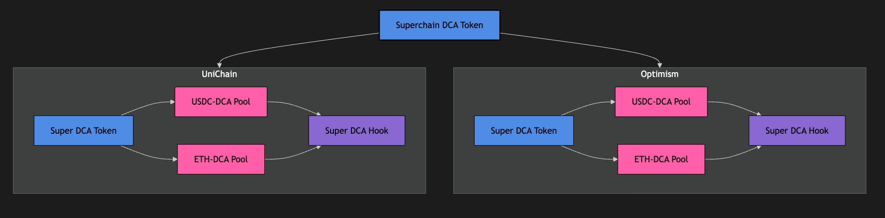

# Super DCA Joins the Superchain App Incubator

Hey Optimism Community! 👋

Earlier this year, we launched [Super DCA's integration with Uniswap, Superfluid, and Gelato on Optimism](https://gov.optimism.io/t/super-dca-s-uniswap-integration-live-on-optimism/9480/1). We also introduced our live Dune Dashboard to provide transparency into performance metrics. Now, we're building on that momentum by joining the **Optimism x Encode Club Superchain Incubator**.

## 🌉 Superchain Interoperability in Action

We're using the Superchain to unlock efficient cross-chain DCA:

- **Cross-Chain Liquidity:** Users can stream tokens on one chain and receive assets on another without extra fees or fragmentation.  
- **Unified Token Logic:** ERC-7802 keeps token behavior consistent across chains with `crosschainMint` and `crosschainBurn`.  
- **Coordinated Execution:** We use Uniswap v4 hooks and Superchain messaging to sync swaps across chains.

## 🛠️ What We're Building Right Now

*Super DCA Superchain Architecture*

We're currently working through **Phase 1** of our development roadmap. Our focus is on setting up local cross-chain infrastructure using SuperSim.

### Phase 1 Goals

- Deploy the DCA token on OPChainA and OPChainB using **CREATE2** to maintain consistent addresses  
- Set up Uniswap v4 infrastructure on both chains  
- Enable swap routing through DCA (e.g., USDC → DCA → ETH)

We plan to ship a working MVP demo by **Week 4** (next week).

## 📅 What Comes Next

### Phase 2 (Weeks 5 to 8)

- Launch our first frontend so users can stream tokens, bridge between chains, and monitor activity  
- Add dynamic fee logic using Uniswap's `beforeSwap` hook  
- Include links for users to add liquidity to USDC-DCA and ETH-DCA pools on Uniswap

### Phase 3 (Weeks 9 to 12)

- Deploy to public testnets  
- Deliver a complete cross-chain demo: stream → bridge → swap → distribute  
- Connect frontend v2 to live RPC endpoints

## 🔗 Cross-Chain DCA for Real Users

Using the OP Stack and ERC-7802 standards, Super DCA will let users:

- Start a DCA stream on one chain and receive assets on another  
- Avoid liquidity fragmentation  
- Coordinate execution securely across chains

## 📡 Follow Our Journey

- X https://x.com/super_dca  
- 🌐 [Website](https://superdca.org/)  
- 📊 [Dune Dashboard](https://dune.com/mikeghen1/super-dca)

We're grateful to Optimism and Encode Club for the support. We're building a real, cross-chain-native DCA experience that puts users first. Let's keep pushing the boundaries of DeFi and cutting out middlemen taking more than their fair share.