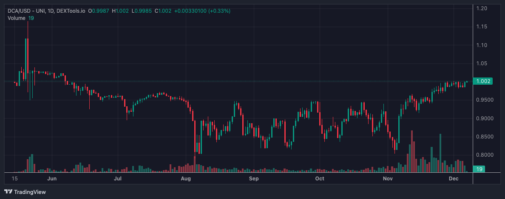
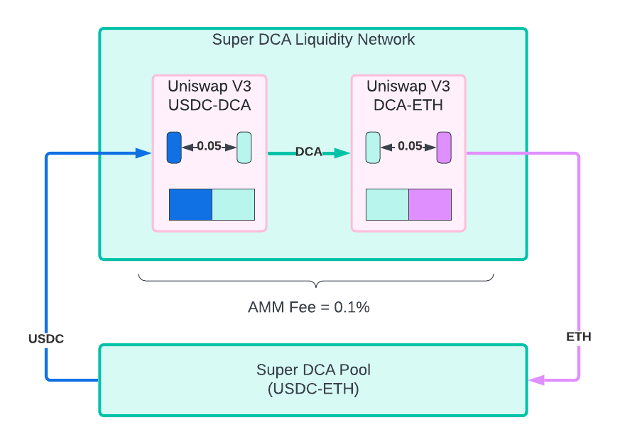
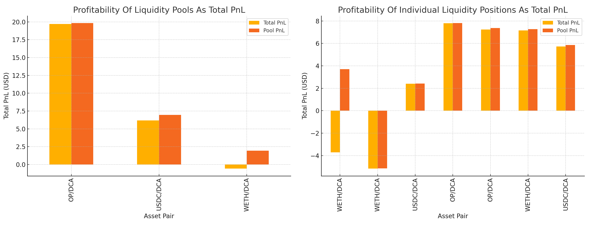
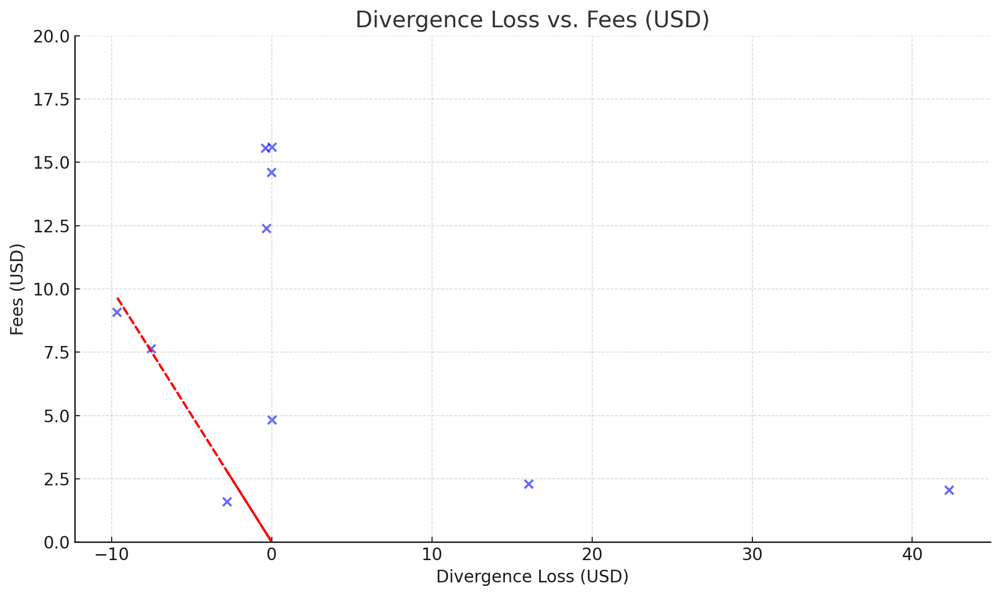
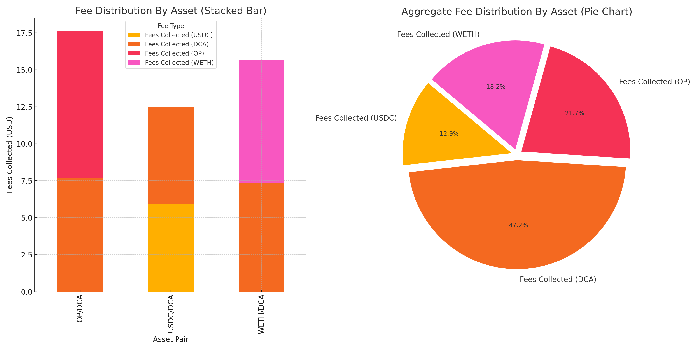

# Evaluating the Super DCA Liquidity Network on Optimism: Performance Insights and Key Metrics

# Introduction

The Super DCA protocol is an innovative implementation of a Time Weighted Average Market Maker (TWAMM). Core to the invention is the establishment of the Liquidity Network that pairs the protocol token (DCA) with each tradable token (e.g., USDC, ETH, etc.). 

To establish the Super DCA Liquidity Network, 10 research participants were each given 1,000 DCA tokens and asked to provide liquidity for the following pairs on Uniswap V3 on Optimism. The initial protocol token exchange rate was set to 1 USDC = 1 protocol token; this makes a simple reference point to start this research study.

Following months of operational activity on Optimism, this post examines the performance metrics of Super DCA liquidity pools, including USDC/DCA, OP/DCA, and WETH/DCA. We analyze profitability, divergence loss, and fee generation using collected data.

**Figure:** DCA exchange rate over time as reported on the DCA/ETH Uniswap V3 pool on Optimism ([Dextools](https://www.dextools.io/app/en/optimism/pair-explorer/0x41b2324ee8cc73b58f7452a6693e0cee98a7ac8d))

# Research Questions

The Super DCA research team seeks to answer two critical research questions in decentralized finance (DeFi):

* Can liquidity providers (LPs) earn competitive yields through a self-sustaining protocol with sub-0.1% fee structures, eliminating the need for intermediary protocol fees?  
* Does this ultra-low fee model reduce total costs (including price impact) for traders compared to existing TWAMM implementations charging 0.5% fees?

This article addresses the first question and examines the profitability of LPs participating in the Super DCA Liquidity Network. 

# Experiment Method

To answer the question, we needed to deploy the system on a live network, in this case, Optimism. The experiment begins by setting up the system described in the Super DCA Whitepaper.

**Figure:** Super DCA Liquidity Network on Optimism, shows how the combinations of ETH-DCA and USDC-DCA are used to offer a USDC-ETH TWAMM route.

The Super DCA Liquidity Network addresses for the token and the three Uniswap V3 Pools that constitute the network are:

* **DCA Token**
    * 0xb1599CDE32181f48f89683d3C5Db5C5D2C7C93cc
* **USDC-DCA**
    * 0x8C8Db50da771F663556a95a39B71305b56C26229
* **WETH-DCA**
    * 0x41B2324Ee8cC73b58f7452A6693E0ceE98A7Ac8D
* **OP-DCA**
    * 0x6b42dd47c53040854892E595B7a79eD26EFEED03
    
Data collection was conducted using [Revert Finance](https://revert.finance/), a source for liquidity pool performance analysis. The data was pulled on 2024-12-01 by scraping information from the site for each of the liquidity pools. After collecting the data, it was analyzed using Python to help reach conclusions. The data used can be found in Google Drive [here](https://drive.google.com/file/d/1hSkqjfTepVtfB5JKIH1g4swjYYZyYS79/view?usp=sharing). Each row represents one Uniswap V3 liquidity pool position.

# Analysis

## Profitability for Liquidity Pools and Their Providers
    
The profitability of each Super DCA pool was measured using Total Profit and Loss (PnL) and Pool PnL metrics recorded by Revert Finance. As shown below, the OP/DCA pool stands out with the highest average profitability, reflecting robust fee collection and favorable market dynamics. This is likely a result of increased volatility in the pool generating more fees. 
   
The USDC/DCA and WETH/DCA pools exhibit mixed results, highlighting the variability in PnL outcomes. This variability stems from the different tokens as well as the different ranges each liquidity provider selected. WETH/DCA, in particular, varies in profitability. This is due to one position being closed, one being full range, and the other (the most profitable) being in a concentrated range. This shows that LPs benefit significantly from concentrated pools.
    

**Figure**: Profitability of Liquidity Pools using PnL as absolute USD values from Revert Finance. *Total* PnL includes gas costs, *Pool* PnL does not. Only 7 of 10 pools are shown since 3 of the pools were closed and the data was missing. 
    
## Divergence Loss (Relative to Hold) vs. Fees Collected
    
To assess the impact of divergence loss on liquidity provider earnings, we compared divergence loss with fees collected in USD. The figure below illustrates that divergence losses are often mitigated by substantial fee collections, particularly in the OP/DCA pool. This underscores the effectiveness of Super DCA’s fee mechanisms in compensating for adverse market movements and protecting LPs from divergence losses. The red line indicates the "break-even" point; to the right of the line are profitable positions, to the left are unprofitable.  
    
In many cases, the divergence loss on each position is near or above 0%. This could be expected as the DCA token price started at 1 USDC, fell slowly over time along with the market, and then rose slowly back to near 1 USDC again at the time this data was pulled. This round trip could be biasing the data.
    

**Figure**: Divergence Loss vs. Fees Collected (DCA)
    
We look specifically at these two poor-performing pools to identify why they are unprofitable. These may represent problems in the design or anomalies in the data. The first pool is a USDC/DCA pool that was closed before the end of the study. The second pool is the WETH/DCA pool with a different range set than the other WETH/DCA pools. This shows that range management is still needed when participating in the network. 
    
## Fee Distribution Across Assets
    
Super DCA pools generated fees in multiple assets, including USDC, DCA, OP, and WETH. As depicted below, the majority of fees were collected in USDC, OP, and WETH. Specifically, 52.8% of the fees collected were in these tokens, while the other 47.2% were collected as DCA tokens. The main observation here is that the fees collected are less than 50% in DCA tokens. However, it's not much less, which could indicate a sample bias. Given that DCA makes up about 50% of the liquidity in the network, a nearly 50/50 split, as observed, is expected.

**Figure**: Fee Distribution by Asset
    
# Conclusions
    
In this article, we analyzed the Super DCA Liquidity Network's performance by examining 10 liquidity pool positions across 3 liquidity pools to understand their total profit and loss, as well as how fees offset divergence loss. Overall, the liquidity positions are profitable. Two exceptions, where divergence loss exceeds the fees collected, are pools with anomalous properties (i.e., closed early, had a bad range). 
    
The results do *not* show unprofitability across the board, as one might expect in this kind of zero-sum system, where a protocol token with no initial value (i.e., nothing to add) is paired with multiple other tokens that are liquid to construct a liquidity network. This lends credence to the idea that some background market activity can produce a small yield for liquidity providers. 
    
# Future Work
    
However, further analysis over longer periods and in more diverse market conditions is required to understand the liquidity providers' return on investment. The effects observed in this study may be biased by when and how long the data collection window was set. 
    
The next step in this research is to replicate the network on other networks in the Superchain ecosystem. Super DCA's Liquidity Network will be set up on Base, and it will have one structural change. On Base, the network will consist of USDC, ETH, and a volatile meme token (e.g., TOSHI, TYBG, HIGHER, etc.). The goal of this construction is to understand the impact of having a high-volatility token in the network. 
    
Furthermore, the charts and graphs developed as part of this study will continue to aid in understanding exactly how the network delivers for the liquidity providers that support it. Future work will focus on recreating these charts in Dune Analytics. 
    
# Join the Conversation!
    
Your feedback is invaluable in driving the evolution of Super DCA. We invite the community to share insights, discuss results, and collaborate on the next phase of innovation for decentralized finance.
    
Thank you for supporting this endeavor! The data collected from months of activity showcase the real-world potential of Super DCA, and your contributions continue to propel this project forward.
    
Regards,  
Mike Ghen (@mikeghen)
